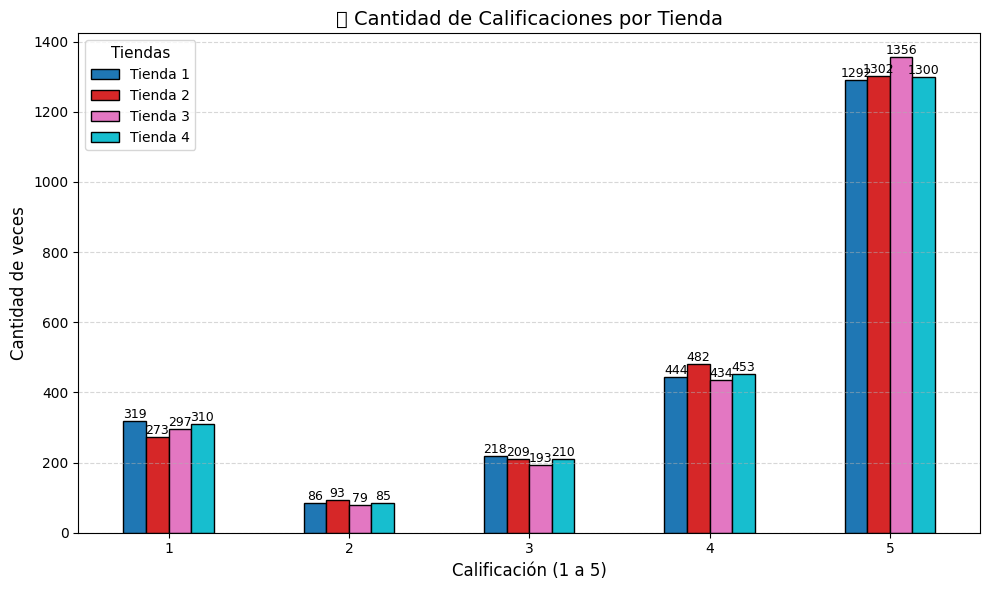
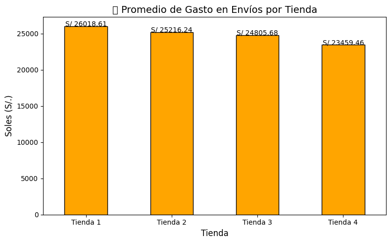

#  Análisis de Datos de Ventas

Este proyecto tiene como objetivo analizar las ventas de diferentes tiendas, obtenidas a partir de archivos CSV públicos. Se ha explorado el comportamiento de productos, categorías, calificaciones, envíos y otros aspectos clave mediante gráficos e insights de negocio.

---

## 📌 Propósito del Análisis

El análisis busca:

- Identificar los productos más y menos vendidos por tienda.
- Analizar las categorías con mayores ingresos.
- Calcular el promedio de calificaciones por tienda.
- Evaluar el gasto promedio en envíos.
- Visualizar la distribución de calificaciones (de 1 a 5 estrellas).
- Generar gráficos comparativos entre tiendas para facilitar la toma de decisiones.

---

## 📁 Estructura del Proyecto

```
📦 alura-store-analysis
├── 📄 alura_store.ipynb            # Notebook principal con el análisis
├── 📄 README.md                    # Este archivo
├── 📂 challenge1-data-science-latam-main    # Archivos CSV con los datos de cada tienda 
│   ├── tienda_1.csv
│   ├── tienda_2.csv
│   ├── tienda_3.csv
│   └── tienda_4.csv
└── 📂 imagenes                       # Carpeta con imágenes exportadas de los gráficos
```

---

## 📊 Ejemplos de Gráficos e Insights

### 1. **Ventas por Categoría (Barras Horizontales)**
Comparación del total vendido por categoría para cada tienda.


### 2. **Radar de Ventas por Tienda**
Visualización en estrella de las categorías más fuertes por tienda.


### 3. **Distribución de Calificaciones**
¿Cuántas calificaciones de 1 a 5 recibió cada tienda?



### 4. **Promedio de costo de envío**
¿Cual es el promedio que gasta cada tiendae en envío?



---

## 📥 Instrucciones para Ejecutar el Notebook

1. **Clona el repositorio** o descarga el archivo `.ipynb`:
   ```bash
   git clone https://github.com/tu_usuario/alura-store-analysis.git
   ```

2. **Instala las dependencias necesarias** (si usas un entorno virtual):
   ```bash
   pip install pandas matplotlib seaborn
   ```

3. **Ejecuta el notebook** en Jupyter o VSCode:
   ```bash
   jupyter notebook alura_store.ipynb
   ```

4. **(Opcional)** Si los datos no están guardados localmente, se descargarán desde URLs en el notebook automáticamente.

---

## 📌 Notas Finales

Este proyecto fue desarrollado como parte del Challenge de Ciencia de Datos de Alura Latam. Puedes modificarlo, agregar nuevas métricas o adaptarlo a otros datasets de ventas 🧠📈
